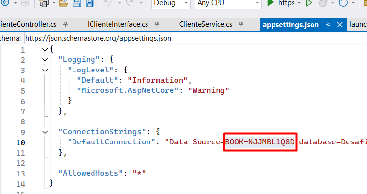
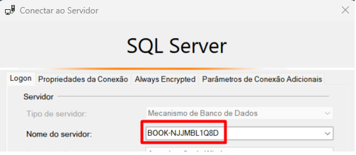

# Desafio API

## Criação da API para vaga de analista/desenvolvedor.
Desenvolvido uma API em C# para testar os conhecimentos solicitados para vaga.

## Tecnologias utilizadas.

* .Net 8
* AspNetCore.Authentication.JwtBearer
* EntityFrameworkCore
* EntityFrameworkCore.Design
* EntityFrameworkCore.SqlServer
* EntityFrameworkCore.Tools
* IdentityModel.Tokens.Jwt
* SQL Server

## End-points.
  

        
  

## Executando a API

Abra a API em sua IDE de preferência, deve ter instalado o banco Sql Server em
sua máquina. Executar os comandos abaixo na sequência pelo Package Manager Console para gerar
o Banco de Dados e as tabelas.
Não esqueça de alterar o Data Source no arquivo appsettings.json caso contrario não irá gera o 
banco.

  

        
  

  Para confirmar esta informação basta olhar o nome do servidor em qual IDE estiver utilizando.

  

        
  

  

        
  

  
* add-migration first-migration
* update-database
  

Após criação do banco pode ser executado a API que irá carregar no navegador
padrão https://localhost:7202/swagger/index.html

  

        
  

Para utilizar os end-points primeiro é necessário logar na API através do 
end-point Conta informando login e password conforme imagem abaixo:

  

        
  

No Response body da requisição irá gerar o token que deve ser copiado para logar
na API e liberar os demais end-points.

  

        
  

Logando na API, siga os passos conforme ordem da imagem abaixo:

  

        
  

